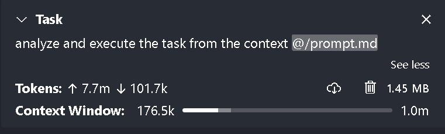
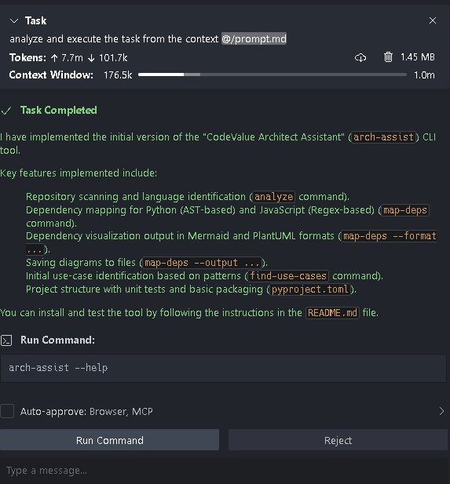

# Intro

## Citates
 - Andrej Karpathy - 10:14 PM · Jan 24, 2023
The hottest new programming language is English

## Projects

Google AlphaEvolve
Apple building with Anthropic Vibe COding platform
OpenAi aquires WindSurf

# Promo

## Subject

Building Architect Assistant using Vibe / Agentic Coding techniques
 
## Short description

- Learn what the Vibe Coding is
- What are the modern techiques and tools
- Using different models for different roles
- Create command line Architect Assistant, helping to map, reverse engineer and visualize the structure of the projects 

## No code / low code 

Lovable, Replit, Base44

## IDE based

Cursor, Windsurf

## VS Code Extensions

GitHub Copilot (Agent just in Preview), Cline, Roo Code

## Command line tools

Aider, Claude Code (Preview), Manus, Codex Cli

## Asynchronous Agents

Codex, Claude Code, Google Jules

# Azure Model Performance with evaluated metrics
https://ai.azure.com/explore/models/benchmarks?wsid=/subscriptions/4d7e9830-d0c0-4bfd-a61c-c082de454a38/resourceGroups/rg-westusaihub/providers/Microsoft.MachineLearningServices/workspaces/cv-matcher&tid=97eefa42-4314-4bb4-b971-3ff5834012bb&modelId=DeepSeek-R1

- gpt-4o-mini is one of the best in value for monue and very good for big context tasks
- DeepSeek-R1 is thinking, but expensive model

# Investigate Claude Code commands
https://docs.anthropic.com/en/docs/agents-and-tools/claude-code/tutorials#create-project-specific-commands

- .cluade/commands - create project specific command here
- /project:...

# AI Coding

## Use rules
    https://github.com/PatrickJS/awesome-cursorrules
    https://dev.to/timesurgelabs/agentic-coding-vibe-coding-best-practices-b4b
    https://github.com/Bhartendu-Kumar/rules_template/blob/main/README.md
    
## Big 3
    Context, Model, Prompt
    
# Vertical Slice Architecture - optimazied for AI coding
Pros:
- Orgonized by feature rather than technical layer
- One prompt context priming
- Minimize cross-cutting concern
- Feature centric 
Cons:
- Code duplication across features
- Requires decepline to NOT build utils.shared code
- Terrible code reuse

# Tips
## Start with initial Basic prompt:

I want to start writing command line tool call CodeValue Architect Assistant 
that will work like Aider or as MCP server.
The tool should help architect in reverse enginering existing projects, 
should be able to analize repository, create dependency map,
find core use-cases, create flow and sequence diagrams in maremaid or pluntuml.

Create me the advanced prompt to be used by code assitant tools like Aider, Cluade Code or Roo Code 
to create CodeValue Architect Assistant. 
 
## Enhance initial prompt

use  https://promptperfect.jina.ai

# Code Assitants - Naive approach results

2 import errors has been fixed:
Tokens: 11.0m / 108.1k - 5.46 MB Context Window: 194.4k-1.0m

## Create a plan

## Create 1 feature at time

## Add tests

## For UI - find free template

 - https://startbootstrap.com/
 
## Add context to Agent

## Add tools using MCP servers

## Setup Roo Code
- https://spin.atomicobject.com/roo-code-ai-assisted-development/

# Claude Code
## 3 folders
https://www.youtube.com/watch?v=hGg3nWp7afg&ab_channel=IndyDevDan

- Agentic coding is a superset of AI Coding
- Context is a king
### ai_docs
- clause_code_best_practices.md
- fc_openai_agents.md
### specs
- spec md files of the project
### .claude
- Reusable prompts we can use with our AI tools.

# Roo Code

## Use Roo Code Memory Bank
- https://github.com/GreatScottyMac/roo-code-memory-bank
- 